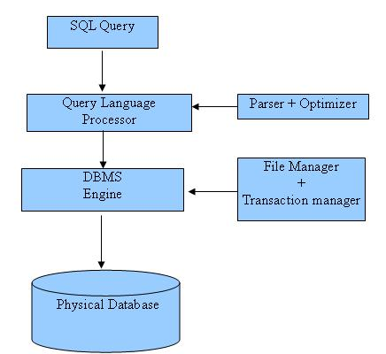

# SQL 概览 #

----------

SQL 指南给你学习结构化查询语言的历程带来独特的体验，它能够帮助你交互地学习 SQL 命令。SQL 是一种数据库语言，能够完成数据库的创建、删除，取回或者修改其中的数据等工作。

SQL 是一个 ANSI（American National Standard Institute，美国国家标准协会）标准。不过，SQL 语言有很多不同的版本存在。

## 什么是 SQL？##

SQL 是结构化查询语言（Structured Query Language），一种用于存储、操作或者检索存储在关系型数据库中数据的计算机语言。

SQL 是关系型数据库系统（Relation Database System）的标准语言。所有的关系型数据库管理系统，例如 MySQL、MS Access、Oracle、Sybase、Informix、Postgres SQL和SQL Server，都使用 SQL 作为其标准数据库语言。

当然，它们用的都是不同的 SQL 方言。例如：

- 微软的 SQL Server 使用的是 T-SQL
- Oracle 使用的是 PL/SQL
- 微软的 Access 中的 SQL 叫做 JET SQL （本地格式）等等

## 为什么要用 SQL？ ##

- 允许用户访问关系型数据库中的数据
- 允许用户对数据做出描述
- 允许用于定义数据库中的数据，并对其进行操作
- 允许通过 SQL 模块、库或者预编译器的等方式，嵌入到其他语言中
- 允许用户创建或删除数据库和表
- 允许用户在数据库中创建视图、存储过程和函数
- 允许用户对表、过程和视图设进行权限设置

## 史海回眸 ##

- 1970 年，IBM 的埃德加·科德博士提出了一种数据库关系模型，他因此被称作关系型数据库之父。
- 1974 年，结构化查询语言面世。
- 1978 年，IBM 对 Codd 提出的概念进行了深入研究，并发布了一款名为 System/R 的产品。
- 1986 年，IBM 开发出了第一个关系型数据库原型，该原型随后被 ANSI 接纳并进行了标准化工作。Relational Software——Oracle 的前身——发布了第一款商业关系型数据库产品。

## SQL 流程 ##

在任何一种 RDBMS 上执行 SQL 命令，数据库管理系统都会判断出执行请求的最佳方式，并由 SQL 引擎推算出具体如何完成任务。

这一流程涉及到了各种各样的组件，包括查询调度器（Query Dispatcher）、优化引擎（Optimization Engines）、经典查询引擎（Classic Query Engine）和 SQL 查询引擎（SQL Query Engine）等等。经典查询引擎用于处理所有的非 SQL 查询，而 SQL 查询引擎则不处理逻辑文件。

下面这张图片简要说明了 SQL 的架构：

## SQL 命令 ##

用于与关系型数据库交互的标准 SQL 命令有 CREATE、SELECT、INSERT、UPDATE、DELETE 和 DROP，这些命令按用途分成如下几组：

### 数据定义语言（Data Definition Language，DDL） ###

<table>
   <tr>
      <td>命令</td>
      <td>描述</td>
   </tr>
   <tr>
      <td>CREATE</td>
      <td>创建新的表、视图或者其他数据库中的对象</td>
   </tr>
   <tr>
      <td>ALTER</td>
      <td>修改现存数据库对象，比如一张表</td>
   </tr>
   <tr>
      <td>DROP</td>
      <td>删除表、视图或者数据库中的其他对象</td>
   </tr>
</table>

### 数据操纵语言（Data Manipulation Language，DML） ###

<table>
   <tr>
      <td>命令</td>
      <td>描述</td>
   </tr>
   <tr>
      <td>SELECT</td>
      <td>从一张或者多张表中检索特定的数据</td>
   </tr>
   <tr>
      <td>INSERT</td>
      <td>创建一条新记录</td>
   </tr>
   <tr>
      <td>UPDATE</td>
      <td>修改记录</td>
   </tr>
   <tr>
      <td>DELETE</td>
      <td>删除记录</td>
   </tr>
</table>

### 数据控制语言（Data Control Language，DCL） ###

<table>
   <tr>
      <td>命令</td>
      <td>描述</td>
   </tr>
   <tr>
      <td>GRANT</td>
      <td>赋予用户特权</td>
   </tr>
   <tr>
      <td>REVOKE</td>
      <td>收回赋予用户的特权</td>
   </tr>
</table>