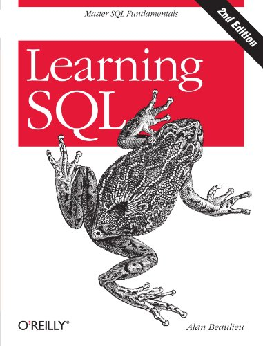
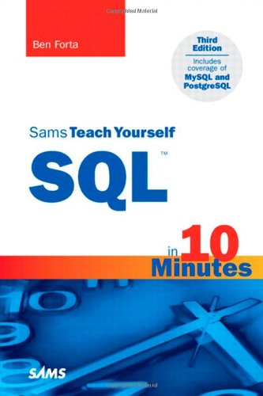
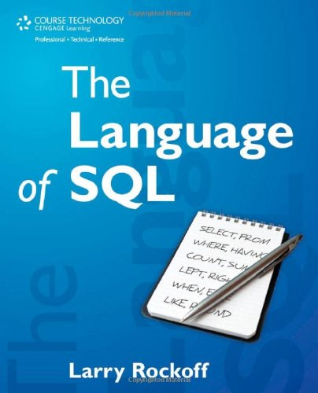
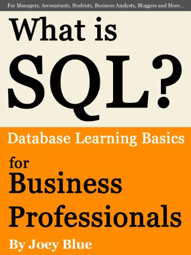
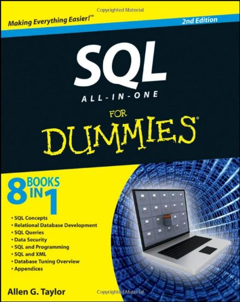
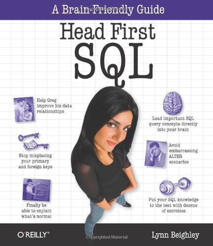

# 一些有用的资源 #

----------

如果你想在这个页面上列出你的网站、书籍或者任何其他形式的资源的话，请联系 webmaster@tutorialspoint.com。

- [ANSI  SQL](http://www.contrib.andrew.cmu.edu/~shadow/sql/sql1992.txt)：数据库操作语言 SQL（DIS 9075, 1992 年 7 月，第二次非正式评审草案）。
- [Structured Query Language](http://publib.boulder.ibm.com/infocenter/db2luw/v9/index.jsp?topic=/com.ibm.db2.udb.admin.doc/doc/c0004100.htm)：面向 SQL 用户的 DB2 资源。
- [Oracle SQL Developer](http://www.oracle.com/technology/products/database/sql_developer/index.html)：Oracle SQL Developer 是一款免费且受到全方位支持的图形界面数据库开发工具。
- [维基百科上的 SQL](http://en.wikipedia.org/wiki/SQL)：一篇有关 SQL 的短文，值得从头至尾全部阅读。
- [MySQL 官方网站](http://www.mysql.com/)：在这里你可以下载到最新的 MySQL 软件，获取有关 MySQL 的新闻更新。对于那些想要使用 MySQL 来构建动态网站的人来说，该网站提供的邮件列表也是极其有用的资源。
- [MySQL 与 Perl](http://www.tutorialspoint.com/perl/perl_database.htm)：这是一份来自 Tutorials Point 的学习指南，里面教给你如何使用 Perl 及其 DBI 扩展来操作 MySQL 数据库。在这里，你将通过例子来学习所有需要的 MySQL 操作。

## 一些关于 SQL 的书籍： ##

  

  